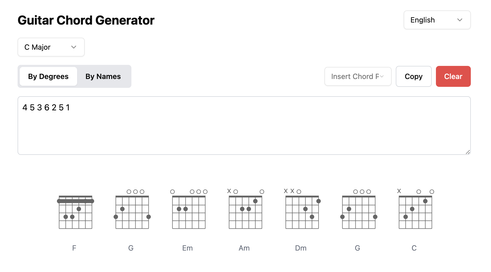

# Guitar Chord Generator 🎸

[](https://cursor.sh)

[中文](./README.md) | English

## Introduction

🎵 Guitar Chord Generator is a web-based guitar chord diagram generator that helps you quickly generate chord diagrams, supporting input by chord degree or chord name, offering various preset chord progressions, a perfect companion for your guitar practice.



## Usage

1. **Select Key**: Choose the song's key from the dropdown menu (C, G, D, A, or E)
2. **Select Input Mode**: By chord degree (e.g., 1, 4, 5) or by chord name (e.g., C, F, G)
3. **Enter Chords**: Type chord sequence in the text box, separated by spaces
4. **Use Presets**: Select from common chord progressions like 1645, Canon chord progression, etc.
5. **View Results**: Chord diagrams will automatically generate below, clearly showing finger positions

## Deployment

Node.js 18 is recommended.

```bash
npm install
npm run dev
``` 
