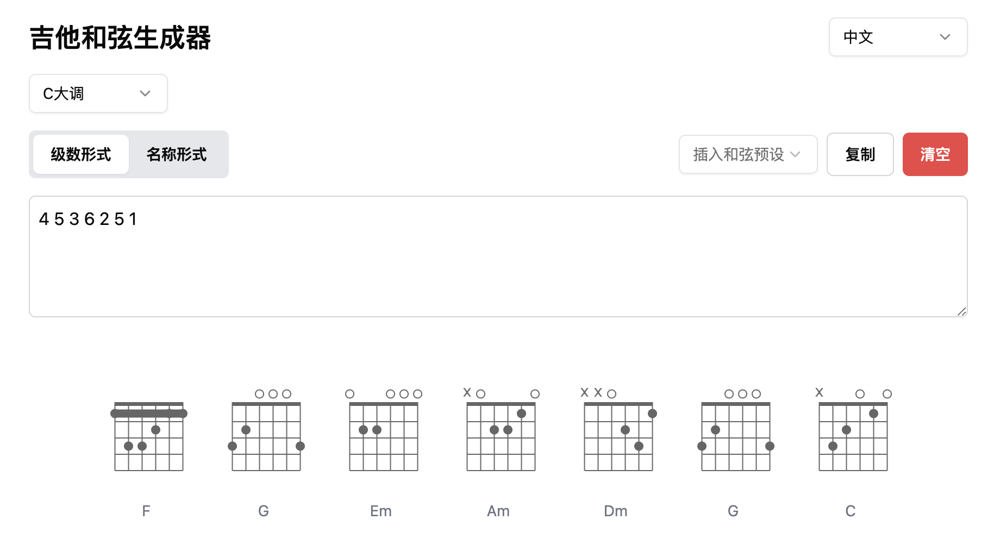

# 吉他和弦图生成器 🎸

[](https://cursor.sh)

中文 | [English](./README.en.md)

## 简介

🎵 Guitar Chord Generator 是一个基于 Web 的吉他和弦图生成工具，帮助你快速生成和弦图，支持按和弦级数或和弦名输入，提供多种预设和弦进行，是你练琴的好帮手。



## 使用说明

1. **选择调性**：从下拉菜单中选择歌曲的调性（C、G、D、A 或 E）
2. **选择输入模式**：按和弦级数（如 1、4、5）或按和弦名（如 C、F、G）
3. **输入和弦**：在文本框中输入和弦序列，用空格分隔
4. **使用预设**：可以从预设中选择常用和弦进行，如 1645、卡农和弦等
5. **查看结果**：和弦图会自动在下方生成，清晰展示指法位置

## 部署说明

推荐使用 Node.js 18。

```bash
npm install
npm run dev
```
